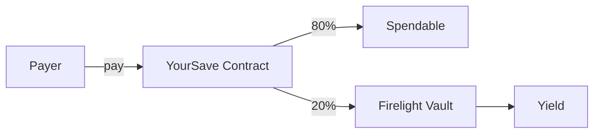

<div align="center">
  
  <h1>YourSave</h1>
  <p>Auto-savings on every FXRP payment, routed to yield protocols on Flare.</p>

  
  
  
</div>

---

## What is YourSave?

YourSave is a programmable savings splitter on Flare. It automatically routes a percentage of every incoming FXRP payment into yield-earning positions — turning saving from a manual chore into an invisible habit.

**Built for Bounty 1: Interoperable Asset Products** — making FXRP more useful across the Flare ecosystem.

## The Problem

Web3 users and merchants lack tools to automate savings from incoming payments. Crypto sits idle in wallets, and manually splitting funds across yield protocols adds friction.

## The Solution

YourSave acts as a programmable routing layer:

1. **Set a savings rule** — e.g., save 20% of all incoming payments
2. **Receive FXRP** — via payment link
3. **Auto-split** — contract splits into spendable + savings
4. **Earn yield** — route savings to Firelight vault, SparkDEX, or Upshift



## Key Features

| Feature | Description |
|---|---|
| **Auto-Savings Split** | Configurable % split on every payment (default 20%) |
| **Payment Links** | Shareable links at `/pay/:address` |
| **Yield Routing** | Route savings to Firelight vault via VaultAdapter |
| **Direct Deposit** | Deposit FXRP directly to vault from wallet |
| **Withdraw Controls** | Separate spend + savings withdrawals |
| **Lock Protection** | Optional time-lock on savings |
| **Multi-language** | English, Indonesian, Chinese |
| **FXRP Faucet** | Built-in testnet faucet at `/app/faucet` |

## Live Demo

**App:** [yoursaving.vercel.app](https://yoursaving.vercel.app)

**Network:** Flare Coston2 Testnet (Chain ID 114)

### Quick Start
1. Connect wallet (MetaMask/Rabby) on Coston2
2. Get FXRP from the [faucet](https://yoursaving.vercel.app/app/faucet)
3. Create a payment link at `/app/link`
4. Pay to the link → savings auto-split
5. Deposit savings to yield at `/app/yield`

## Deployed Contracts

| Contract | Address |
|---|---|
| **YourSave** | [`0x588DeC...1d3A`](https://coston2-explorer.flare.network/address/0x588DeC15D915659E8BF36c01e662479916301d3A) |
| **VaultAdapter** | [`0x3c13B...0b4`](https://coston2-explorer.flare.network/address/0x3c13BDd505DE69bB0DF0a2e68A0Cd93a44beB0b4) |
| **FxrpVault** | [`0x78078...26Ec`](https://coston2-explorer.flare.network/address/0x780780D122f075ada1Fa86A18dE2e0763B2526Ec) |
| **SparkDexAdapter** | [`0xD04A3...3E6`](https://coston2-explorer.flare.network/address/0xD04A92C83AFe71f4f69F9FAD0A33229BFBdE33E6) |
| **FXRP** | [`0x0b6A...dc7`](https://coston2-explorer.flare.network/address/0x0b6A3645c240605887a5532109323A3E12273dc7) |

## Flare Integration

- **FAssets / FXRP** — Primary asset (6 decimals on Coston2)
- **Flare Coston2** — Testnet deployment (Chain ID 114)
- **Firelight** — ERC-4626 vault for FXRP yield
- **SparkDEX** — Uniswap V3 fork for token swaps
- **Upshift** — Auto-compound yield vaults

See [docs/flare-integration.md](docs/flare-integration.md) for details.

## Repository Layout

```
├── evm/              # Smart contracts (Solidity, Foundry)
├── web/              # Frontend (React, Vite, TypeScript)
├── docs/             # Documentation
│   ├── architecture.md
│   ├── deployment.md
│   ├── development.md
│   └── flare-integration.md
├── deployments.json  # Deployed addresses
└── push.sh           # Git push helper
```

## Running Locally

### Smart Contracts

```bash
cd evm
git submodule update --init
cp .env.example .env  # Set FLARE_RPC_URL + DEPLOYER_PRIVATE_KEY
~/.foundry/bin/forge build
~/.foundry/bin/forge test
```

### Frontend

```bash
cd web
npm install
npm run dev    # http://localhost:5173
```

See [docs/development.md](docs/development.md) for full setup guide.

## Documentation

| Doc | Description |
|---|---|
| [Architecture](docs/architecture.md) | System design, contract flow, frontend structure |
| [Deployment](docs/deployment.md) | Addresses, deploy scripts, env variables |
| [Development](docs/development.md) | Local setup, commands, gotchas, debugging |
| [Flare Integration](docs/flare-integration.md) | How FXRP, FAssets, SparkDEX, Firelight are used |

## What Was Built

### Smart Contracts
- `YourSave.sol` — Core savings contract with auto-split, yield targets, lock protection
- `VaultAdapter.sol` — ERC-4626 vault deposit adapter
- `SparkDexAdapter.sol` — SparkDEX V3 swap adapter
- `FxrpVault.sol` — Custom ERC-4626 vault for FXRP
- `ISparkDexRouter.sol` — SparkDEX interface

### Frontend
- Full React app with dashboard, payment links, yield management, faucet
- Direct wallet deposit to vault
- Multi-language support (EN, ID, ZH)
- FXRP balance + vault balance display
- Payment link pages with background branding

### Infrastructure
- Foundry deployment scripts
- Vercel deployment with SPA routing
- Auto-commit git workflow (`push.sh`)

## License

MIT
