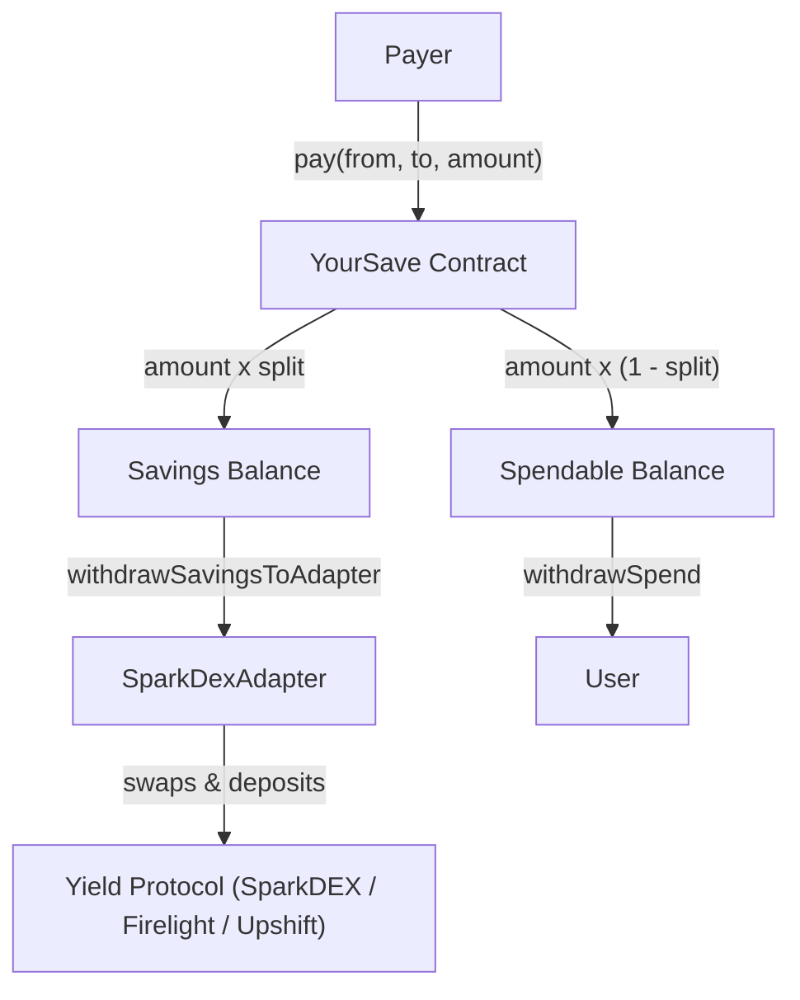

<div align="center">
  
  <h1>YourSave</h1>
  <p>Auto-savings on every payment, powered by FXRP on Flare.</p>

  
  
  
</div>

---

YourSave is a programmable savings splitter that automatically routes a portion of every incoming payment into yield-earning positions on Flare.

Built for **Bounty 1: Interoperable Asset Products** — making FXRP more useful across the Flare ecosystem.

## How it works



The recipient sets their own savings rule (default 20%) and picks where they want to earn yield: **SparkDEX** (DEX liquidity), **Firelight** (ERC-4626 vaults), or **Upshift** (auto-compound strategies).

## Deployed contracts (Flare Coston2 Testnet)

| Contract | Address | Explorer |
| --- | --- | --- |
| **YourSave** | `0x588DeC15D915659E8BF36c01e662479916301d3A` | [View](https://coston2-explorer.flare.network/address/0x588DeC15D915659E8BF36c01e662479916301d3A) |
| **SparkDexAdapter** | `0xD04A92C83AFe71f4f69F9FAD0A33229BFBdE33E6` | [View](https://coston2-explorer.flare.network/address/0xD04A92C83AFe71f4f69F9FAD0A33229BFBdE33E6) |

### Protocol addresses (Flare Coston2)

| Protocol | Address |
| --- | --- |
| FXRP | `0x0b6A3645c240605887a5532109323A3E12273dc7` |
| SparkDEX Router | `0x4a1E5A90e9943467FAd1acea1E7F0e5e88472a1e` |
| Firelight Vault | `0xC90D6847747b85d1fa2E07859869fb9fB72c0361` |
| Upshift Vault | `0x24c1a47cD5e8473b64EAB2a94515a196E10C7C81` |

## Repository layout

- `evm/` - Smart contracts workspace (Solidity, Foundry/Forge)
- `web/` - Frontend application (React, Vite, TypeScript, Tailwind CSS v4, Ethers.js)
- `plan.md` — Full migration plan (EVM Sepolia → Flare Coston2)
- `deployments.json` — Deployed contract addresses

## Running locally

### 1. Smart Contracts (Foundry)

```bash
cd evm
cp .env.example .env  # Set FLARE_RPC_URL and DEPLOYER_PRIVATE_KEY
/Users/em/.foundry/bin/forge build
/Users/em/.foundry/bin/forge test
```

### 2. Frontend Development

```bash
cd web
cp .env.example .env
# VITE_YOURSAVE_ADDRESS is pre-filled with deployed contract
npm install
npm run dev
```

The frontend will start at [http://localhost:5173/](http://localhost:5173/).

### 3. Deploy to Coston2

```bash
cd evm
# Get testnet C2FLR from https://faucet.flare.network/coston2
/Users/em/.foundry/bin/forge create src/Save.sol:YourSave \
  --rpc-url $FLARE_RPC_URL \
  --private-key $DEPLOYER_PRIVATE_KEY \
  --broadcast
```

## Trying the app

1. Install an EVM browser wallet (e.g. MetaMask, Rabby) and connect to **Flare Coston2 Testnet** (chain ID 114).
2. Connect your wallet on the dashboard. The app will prompt to add and switch networks automatically.
3. Fund your wallet with testnet C2FLR (from [Flare Faucet](https://faucet.flare.network/coston2)) and testnet FXRP.
4. Simulate an incoming payment and watch it split into spendable and savings balances.
5. On the Rules page, switch the yield target between **SparkDEX**, **Firelight**, and **Upshift**.

## Flare Integration

- **FAssets/FXRP**: Primary asset — savings are denominated in FXRP (wrapped XRP on Flare), 18 decimals
- **Flare Coston2**: Testnet for deployment and testing (chain ID 114, RPC: `https://coston2-api.flare.network/ext/C/rpc`)
- **SparkDEX**: Uniswap V3 fork for token swaps and liquidity pools
- **Firelight**: ERC-4626 compliant yield vaults for FXRP
- **Upshift**: Strategy-driven auto-compound vaults
- **Flare Data Connector (FDC)**: Powers cross-chain payment verification

## What was built / migrated

### Newly built
- `YourSave.sol` — Core savings contract with SparkDEX/Firelight/Upshift yield targets
- `SparkDexAdapter.sol` — Adapter for routing savings into SparkDEX V3 pools
- `ISparkDexRouter.sol` — SparkDEX V3 router interface
- Full React frontend with Flare Coston2 integration
- FXRP 18-decimal formatting and wallet auto-switch to Flare Coston2

### Migrated from EVM Sepolia
- Network: Ethereum Sepolia → Flare Coston2
- Asset: USDC (7 decimals) → FXRP (18 decimals)
- Yield: iExec Nox / Blend / Soroswap / Defindex → SparkDEX / Firelight / Upshift
- All old Stellar/iExec code removed

## Next Steps

- [ ] Integrate FAssets SDK for direct FXRP minting flow
- [ ] Add cross-chain XRP balance display
- [ ] Implement FXRP onboarding flow (XRP → FXRP via FDC proof)
- [ ] Mainnet deployment (Flare Mainnet)
- [ ] Real SparkDEX V3 SwapRouter integration
- [ ] User testing and feedback
