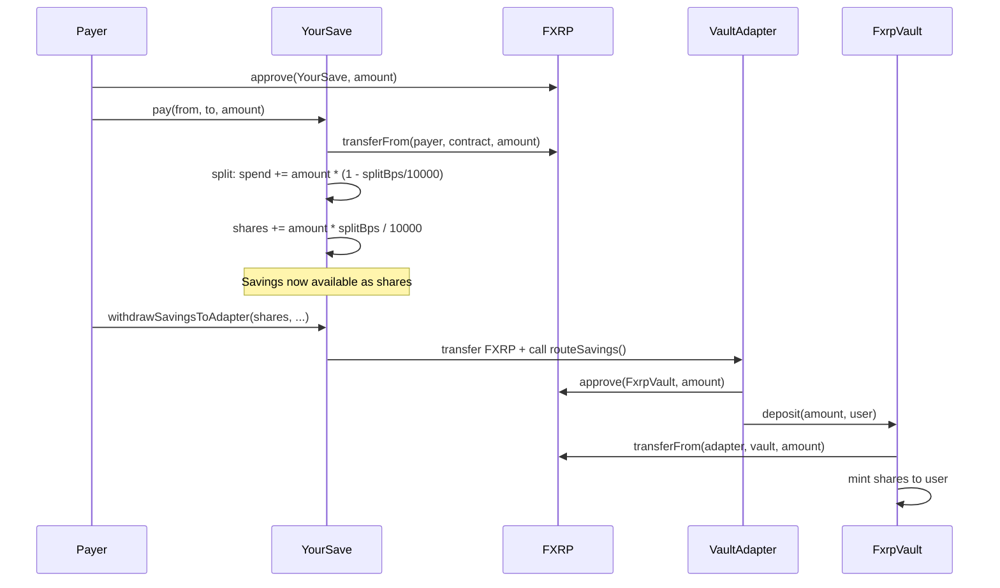
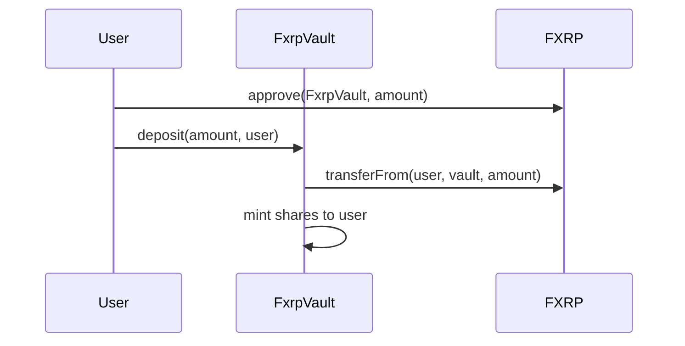

# Architecture

## System Overview

YourSave is a programmable savings splitter on Flare Coston2. It automatically routes a portion of every incoming FXRP payment into yield-earning positions.

### Core Components

```
┌─────────────────────────────────────────────────────────────┐
│                        Frontend (React + Vite + TS)          │
│  ┌──────────┐ ┌──────────┐ ┌──────────┐ ┌───────────────┐  │
│  │ Dashboard │ │ Pay Page │ │ Yield    │ │ Rules/Settings │  │
│  └────┬─────┘ └────┬─────┘ └────┬─────┘ └───────┬───────┘  │
│       │             │            │                │          │
│       └─────────────┴────────────┴────────────────┘          │
│                           │ ethers.js v6                      │
└───────────────────────────┼───────────────────────────────────┘
                            │
┌───────────────────────────┼───────────────────────────────────┐
│                    Flare Coston2 (Chain ID 114)                │
│                           │                                    │
│  ┌────────────────────────▼────────────────────────────────┐  │
│  │                    YourSave Contract                     │  │
│  │  • pay(from, to, amount) — split into spend + savings   │  │
│  │  • withdrawSpend() — pull spendable balance             │  │
│  │  • withdrawSavings() — pull savings as FXRP             │  │
│  │  • withdrawSavingsToAdapter() — route to yield protocol │  │
│  │  • setSplit() / setLock() / setYieldTarget()            │  │
│  └──────┬──────────────────────────────┬───────────────────┘  │
│         │                              │                       │
│  ┌──────▼───────┐            ┌─────────▼──────────┐           │
│  │ VaultAdapter │            │ SparkDexAdapter     │           │
│  │ (ERC-4626)   │            │ (SparkDEX V3 swap)  │           │
│  └──────┬───────┘            └─────────┬──────────┘           │
│         │                              │                       │
│  ┌──────▼───────┐            ┌─────────▼──────────┐           │
│  │  FxrpVault   │            │  SparkDEX Router    │           │
│  │  (ERC-4626)  │            │  (Uniswap V3 fork)  │           │
│  └──────────────┘            └────────────────────┘           │
│                                                               │
│  ┌──────────────────────────────────────────────────────┐     │
│  │                    FXRP Token                         │     │
│  │  (FAssets wrapped XRP, 6 decimals on Coston2)        │     │
│  └──────────────────────────────────────────────────────┘     │
└───────────────────────────────────────────────────────────────┘
```

## Smart Contracts

### YourSave (Core)

The main savings contract. Holds FXRP from payments and manages per-user accounts.

**Account struct:**
```solidity
struct Account {
    uint16 splitBps;      // Savings split in basis points (default 2000 = 20%)
    uint128 spend;        // Spendable balance
    uint128 shares;       // Savings shares (1:1 with FXRP)
    uint64 lockUntil;     // Lock timestamp
    YieldTarget yieldTarget; // 0=SparkDEX, 1=Firelight, 2=Upshift
}
```

**Key functions:**
- `pay(from, to, amount)` — Transfers FXRP from payer, splits into spend/savings
- `withdrawSpend(user, amount)` — Withdraws spendable balance to wallet
- `withdrawSavings(user, shares)` — Withdraws savings as FXRP
- `withdrawSavingsToAdapter(shares, tokenIn, tokenOut, adapter, amountOutMin, deadline)` — Routes savings through an adapter to a yield protocol
- `setSplit(user, bps)` — Sets savings percentage (0-10000 bps)
- `setLock(user, until)` — Sets withdrawal lock date
- `setYieldTarget(user, target)` — Sets yield protocol (SparkDEX/Firelight/Upshift)

### VaultAdapter

Deposits FXRP into ERC-4626 vaults (Firelight, Upshift, or custom FxrpVault).

```solidity
function routeSavings(
    address tokenIn,    // FXRP address
    uint256 amountIn,   // Amount to deposit
    address vault,      // ERC-4626 vault address
    address to,         // Recipient of vault shares
    uint256 amountOutMin, // Minimum shares (slippage)
    uint256 deadline    // Unused (vault deposits settle instantly)
) external returns (uint256[] memory amounts);
```

### SparkDexAdapter

Swaps FXRP into another token via SparkDEX V3 (Uniswap V3 fork).

```solidity
function routeSavings(
    address tokenIn,
    uint256 amountIn,
    address tokenOut,
    address to,
    uint256 amountOutMin,
    uint256 deadline
) external returns (uint256[] memory amounts);
```

### FxrpVault (Custom ERC-4626)

A minimal ERC-4626 vault that accepts FXRP deposits and mints shares 1:1.

- `deposit(assets, receiver)` — Deposit FXRP, receive vault shares
- `redeem(shares, receiver, owner)` — Burn shares, receive FXRP
- `maxDeposit()` — Returns `type(uint256).max` (unlimited deposits)
- `asset()` — Returns FXRP address
- `convertToShares(assets)` — 1:1 ratio (no yield yet, pure vault)

## Payment Flow



## Direct Deposit Flow (Bypass YourSave)

Users can also deposit FXRP directly to the vault from their wallet, without going through the YourSave contract:



This is handled by `depositYieldDirect()` in the frontend, which:
1. Normalizes addresses (EIP-55 checksum)
2. Approves FXRP to the vault
3. Calls `vault.deposit.staticCall()` to simulate
4. Sends the real transaction with `gasLimit: 500_000`

## Yield Targets

| Target | Type | Contract | Status |
|---|---|---|---|
| **Firelight** | ERC-4626 Vault | `0x780780D122f075ada1Fa86A18dE2e0763B2526Ec` | ✅ Working |
| **SparkDEX** | DEX Swap | Via SparkDexAdapter | ⚠️ No valid tokenOut on testnet |
| **Upshift** | ERC-4626 Vault | `0x24c1a47cD5e8473b64EAB2a94515a196E10C7C81` | ⚠️ Not accepting deposits |

## Frontend Architecture

```
web/src/
├── lib/
│   ├── config.ts          # Contract addresses, RPC URLs, chain config
│   ├── yoursave.ts        # Service entry (mock vs evm)
│   ├── yoursave.evm.ts    # EVM contract interactions
│   ├── yoursave.mock.ts   # In-memory mock for dev
│   ├── fxrp.ts            # FXRP token utilities
│   ├── app-state.tsx      # Global state (account, activity, rates)
│   ├── errors.ts          # Error code mapping
│   ├── i18n.tsx           # Translations (EN, ID, ZH)
│   ├── yield.ts           # Yield calculations, share price, vault stats
│   ├── use-yield-data.ts  # Yield data hook
│   ├── activity.ts        # On-chain event parsing
│   ├── rates.ts           # FX rates
│   └── wallet.tsx         # Wallet connection hook
├── components/
│   ├── balance-hero.tsx   # Main balance display (includes vault balance)
│   ├── yield-deposit-card.tsx      # Deposit savings to yield
│   ├── yield-direct-deposit-card.tsx # Direct wallet deposit
│   ├── yield-sources-card.tsx      # Yield protocol selector
│   ├── yield-position-card.tsx     # Savings position display
│   └── ui/               # shadcn-style UI components
├── pages/
│   ├── dashboard.tsx      # Main dashboard
│   ├── pay.tsx            # Payment link page
│   ├── yield.tsx          # Yield management page
│   ├── faucet.tsx         # FXRP faucet
│   ├── rules.tsx          # Split/lock/yield settings
│   ├── withdraw.tsx       # Withdraw spend/savings
│   ├── activity.tsx       # Transaction history
│   └── settings.tsx       # App settings
└── App.tsx                # Router setup
```

## State Management

The app uses a custom `AppStateProvider` context:

- `account` — YourSave account data (split, spend, shares, lock, yieldTarget)
- `activity` — Parsed on-chain events (payments, withdrawals, settings changes)
- `rates` — FX rates for display
- `busy` — Currently running action key (prevents double-submits)
- `runAction()` — Executes a contract call with error handling, toast notifications, and 2s RPC sync delay

## Error Handling

All contract errors are mapped to user-friendly i18n keys via `errors.ts`:

```
Contract error → Error(Contract, #N) → errors.ts lookup → i18n key → Toast message
```

Custom patterns handle:
- Wallet rejection/cancellation
- Wrong network
- Vault not accepting deposits
- Insufficient allowance
- Transaction reverted
